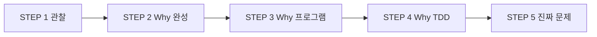

# MagicSquare_XX

4×4 Magic Square를 다루는 소프트웨어 프로젝트입니다.  
현재 단계는 **구현 이전의 문제 정의(Problem Definition)** 이며, QA·TDD 관점에서 **검증 가능한 규칙과 판정 기준**을 고정하는 것이 1차 목표입니다.

---

## 프로젝트가 풀려는 문제

### 표면 요구 (피해야 할 정의)

> 「4×4 마방진을 만드는 프로그램을 만든다.」

「만든다」·「완성」·「마방진」만으로는 생성/검증/입력 책임, 다중 정답, 성공 기준이 분명하지 않습니다.

### 진짜 문제 (현재 합의)

> **4×4 격자에 1~16이 각각 한 번씩 배치된 경우, 합의된 선(행·열·정의된 대각선)마다 합이 34인지를 결정론적으로 판정하고, 그 기준을 반복 실행·자동 검증·회귀에 사용할 수 있게 고정하는 것.**

| 구분 | 표면 | 진짜 |
|------|------|------|
| 대상 | 마방진 한 장 | 4×4 배치에 대한 **규칙 판정** |
| 성공 | 숫자가 채워짐 | 유·무효에 **일관된 판정** |
| 산출물 | 실행 파일 | **고정된 판정 기준 + 검증 가능한 요구** |

생성·UI·학습 게임 등은 **판정 문제** 위에 올리는 2차 범위로 둡니다.

---

## 왜 이 프로젝트인가

- **4×4**: 규칙이 명확하고(마법 상수 34), 규모가 작아 QA·TDD 연습에 적합합니다.
- **프로그램**: 같은 규칙을 **반복** 적용하고, **자동 검증**·**오류 방지**·**규칙 기반 사고**를 훈련하기 위함입니다.
- **TDD**: 판정 기준·불변식·입출력 계약을 구현보다 먼저 **통제**하기 위한 설계 방식 후보입니다.

---

## 핵심 Invariant (요약)

### 도메인

| ID | 내용 |
|----|------|
| D1 | 항상 **4×4** 격자 |
| D2 | 값은 **1~16 순열** (중복·누락 없음) |
| D3 | 검사 대상 각 선의 합 = **34** |
| D4 | 검사 **선 집합**은 요구에 명시·고정 |

D2가 깨지면 D3만으로 「유효」라고 하지 않습니다.

### 판정·품질

| ID | 내용 |
|----|------|
| P1 | 「만족」= D1~D4 **모두** 충족 |
| P2 | 동일 입력 → 동일 판정(및 실패 분류) |
| P3 | 순열·범위 위반은 합이 맞아도 **불만족** |
| Q1~Q3 | 기준 변경 시 검증 선행, 회귀 추적, I/O 계약 일치 |

---

## 훈련 목표 (사고 능력)

구현 기술보다 다음을 연습하는 프로젝트로 봅니다.

- **요구 분해** — 순열 / 선 합 / 검사 범위 / 입출력 경계
- **오라클 설계** — 유·무효 대표 예시, 다중 정답 이해
- **불변식 사고** — 부분 만족 vs 전역 유효
- **계약·경계** — 완성 격자만 vs 부분 입력, 실패 이유 명시
- **검증·회귀** — 반복 가능한 기대, 요구 변경 영향 예측
- **범위 통제** — 검증기 우선, 데모 완료 ≠ 규칙 증명

---

## 현재 상태

| 항목 | 상태 |
|------|------|
| 문제 정의 (STEP 1~5) | ✅ 완료 |
| Must / Should / Won’t | ⏳ 예정 |
| 유·무효 대표 예시 표 | ⏳ 예정 |
| 입출력 계약 초안 | ⏳ 예정 |
| 구현·테스트 코드 | ❌ 아직 없음 |

---

## 저장소 구조

```
MagicSquare_XX/
├── README.md                 ← 이 파일 (프로젝트 개요)
├── Report/                   ← 문제 정의 보고서
│   ├── README.md
│   └── 01. MagicSquare_Problem-Definition-Report.md
└── Prompting/                ← 문제 정의 워크숍 프롬프트·대화 기록
    └── 01. cursor_4x4_magic_square_problem_definit-Prompt.md
```

---

## 문서

| 문서 | 설명 |
|------|------|
| [Report/01. MagicSquare_Problem-Definition-Report.md](./Report/01.%20MagicSquare_Problem-Definition-Report.md) | STEP 1~5 통합 보고서 (관찰, Why #1~#3, 진짜 문제 정의, Invariant) |
| [Report/README.md](./Report/README.md) | Report 폴더 안내 |
| [Prompting/01. cursor_4x4_magic_square_problem_definit-Prompt.md](./Prompting/01.%20cursor_4x4_magic_square_problem_definit-Prompt.md) | 문제 정의 단계 프롬프트·대화보내기 |

보고서에는 **구현 설계, 코드, 알고리즘**을 포함하지 않습니다.

---

## 문제 정의 단계 요약



1. **관찰** — 미정의 과제, QA·학습 맥락  
2. **Why #1** — 완성 = 증거(oracle), 정의·책임 모호성 분석  
3. **Why #2** — 반복 가능성, 검증 자동화, 오류 방지, 규칙 사고  
4. **Why #3** — TDD로 판정·불변식·I/O 통제  
5. **진짜 문제** — 규칙 판정 고정이 1차 목표  

---

## 다음 단계 (권장)

1. 이해관계자·**Must / Should / Won’t** 정리  
2. 유효·무효 **대표 예시 표** (판정 기대 포함)  
3. **입출력 계약** 초안 (완성 격자 only vs 부분 입력)  
4. 1차 TDD 범위 결정 (**검증기 only** 여부)  

---

## 대상 독자

- QA · 요구·테스트 설계 담당  
- TDD로 도메인 규칙을 먼저 고정하려는 개발자  
- 4×4 마방진을 **작은 규칙 엔진** 연습 문제로 쓰는 학습자  

---

## 변경 이력

| 버전 | 일자 | 내용 |
|------|------|------|
| 1.0 | 2026-05-28 | 프로젝트 README 초안 (STEP 1~5 기반) |
