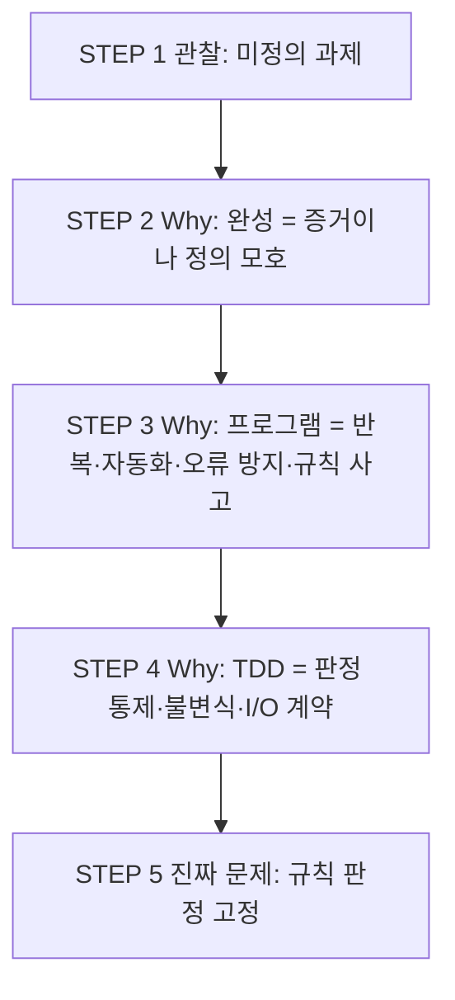

# 4×4 Magic Square — 문제 정의 보고서

| 항목 | 내용 |
|------|------|
| 프로젝트 | MagicSquare_XX |
| 문서 유형 | 문제 인식 · Why 분석 · 진짜 문제 정의 |
| 대상 독자 | QA, 요구·테스트 설계 담당 |
| 작성 기준일 | 2026-05-28 |
| 범위 | STEP 1 ~ STEP 5 (구현·설계·코드·알고리즘 제외) |

---

## 문서 목적

본 보고서는 4×4 Magic Square 관련 프로그램을 **설계·구현하기 전**에 수행한 **문제 인식(Problem Recognition)** 과 **Why 분석**, **진짜 문제 정의**를 한곳에 정리한 것이다.  
목표는 「마방진을 만든다」는 표면 요구를 **검증 가능한 규칙·불변식·QA/TDD 맥락**으로 재정의하는 것이다.

---

## STEP 1 — Observation (관찰)

### 1.1 현재 우리가 해결하려는 상황은 무엇인가?

**관찰된 상황:**  
QA 전문가가 **4×4 격자에 1~16을 한 번씩 배치했을 때, 행·열·대각선 합이 모두 같아지는지**를 판단·생성·검증할 수 있는 **소프트웨어 산출물**을 만들려는 시점에 있다.  
프로젝트 워크스페이스는 초기 상태로, **요구가 말로만 존재하고 실행 가능한 기준·입출력·검증 규칙은 아직 고정되지 않았다.**

해결 대상은 “숫자 퍼즐” 자체보다 다음에 가깝다.

- **무엇을 ‘올바른 4×4 배치’라고 부를지**에 대한 공통 정의 부재  
- **사람(QA)이 기대하는 동작**과 **프로그램이 실제로 할 일** 사이의 간극  
- **테스트 가능한 요구**로 바꾸기 전의 **모호한 목표**(「4×4 마방진 프로그램」)

**관찰 관점 요약:**  
*「16칸 배열에 대한 합 일치 규칙을, 사람이 쓰거나 QA가 검증할 수 있는 형태로 다루고 싶다」*는 **미정의 과제**가 놓여 있다.

### 1.2 왜 4×4 마방진 문제를 다루는가?

| 관점 | 관찰 |
|------|------|
| **규모** | 3×3보다 제약이 많고, 5×5보다 복잡도가 낮아 **알고리즘·테스트 설계를 연습하기에 적당한 크기** |
| **검증** | 「모든 행·열·대각선의 합 = 34」처럼 **명확한 수학적 불변식**이 있어, QA가 **기대값·경계·실패 케이스**를 정의하기 쉬움 |
| **역할** | QA로서 **요구 명세 → 테스트 케이스 → 구현 검증** 흐름을 짧은 주제로 경험할 수 있음 |
| **제품** | 「생성 / 입력 / 검증 / 출력」 중 **어느 기능까지 포함할지**를 나누어 논의할 수 있는 **대표적 도메인 모델** |

목적은 “고대 수학 퍼즐 완성”이 아니라, **작지만 비자명한 규칙을 가진 시스템을 QA 관점에서 정의·검증하는 연습 대상**을 고른 상황에 가깝다.

### 1.3 이 문제는 어떤 학습 또는 시스템 설계 맥락에서 등장하는가?

**학습 맥락**

- **요구 공학:** 「마방진」 한 단어를 **입력·출력·오류·성능·부분 기능**으로 쪼개는 연습  
- **테스트 설계:** 동치 클래스(유효 격자 / 무효 격자 / 경계값 / 중복·누락 숫자 등)  
- **알고리즘 기초:** 고정 규칙 vs 탐색·제약 만족 — 설계 전 단계에서는 「등장 가능한 맥락」만 관찰  
- **품질 관점:** 「맞는 답 하나」가 아니라 **다중 정답·대칭·동일 합**을 요구에 어떻게 쓸지

**시스템 설계 맥락**

- **핵심 도메인:** 4×4 격자, 1~16 셀, 선 합, 마법 상수 34  
- **기능 경계 후보:** 생성만 / 검증만 / 사용자 입력 편집 / 힌트·부분 채우기 — **아직 미결정**  
- **인터페이스:** CLI, 라이브러리, 웹 UI 등 **채널 미정**  
- **비기능:** 4×4는 작아 **성능 이슈는 거의 없고**, **정확성·메시지·테스트 자동화**가 설계의 중심이 될 가능성이 큼

**STEP 1 한 줄 정리:**  
QA 관점에서, **아직 정의되지 않은 「4×4 숫자 격자의 합 일치 규칙」을 다루는 소프트웨어**를 만들려는 초기 단계이며, 목적은 퍼즐 자체보다 **검증 가능한 요구와 테스트 가능한 시스템 경계를 세우는 것**에 가깝다.

---

## STEP 2 — Why #1

### 2.1 질문

**Q:** 왜 마방진을 완성해야 하는가?

### 2.2 가정한 답 (A)

> **「4×4 마방진을 완성해야 하는 이유는, ‘행·열·대각선 합이 모두 34인 유효한 격자’라는 요구를 프로그램이 충족한다는 것을 사람과 테스트가 동일한 기준으로 확인할 수 있는 구체적인 결과물이 필요하기 때문이다.」**

완성은 **퍼즐 취미**가 아니라 **요구 충족의 증거(oracle)** 로서 필요하다. QA 관점에서 「끝 상태가 맞다」는 것을 보여 주는 **참조 답(ground truth)** 이 있어야 검증·회귀·인수가 가능하다.

### 2.3 A에서 드러나는 불편함 · 구조적 문제

#### (1) 「완성」의 의미가 하나로 고정되지 않음

- 4×4 **정규** 마방진은 **여러 개** 존재할 수 있음(대칭·회전·반사)  
- **단일 정답 오라클** vs **다중 정답 도메인** 충돌  
- 특정 패턴만 생성하면 **과검증(false negative)** 위험  

**불편:** 「완성」이 **수학적 유효성**인지 **정해진 하나의 표준 격자**인지 명시되지 않으면, 공통 기준 확인 목적이 **기준 불일치**를 만든다.

#### (2) 완성은 목표이면서 검증 수단 — 역할 겹침

- 생성 기능이 있으면: 완성품이 **구현 증거**이면서 **그 구현의 산출물** → 순환 논리에 가까움  
- 검증만 있으면: 완성은 **사용자·외부 입력** 의존 → 책임 주체 불명  

#### (3) 「합 = 34」만으로는 QA 오라클이 불완전할 수 있음

- 합만 검사 시 **중복·누락**과 구분 필요  
- 대각선·끊긴 대각선(broken diagonal) 포함 여부는 **명시적 결정** 필요  
- 부분 완성을 **실패** vs **진행 중**으로 볼지 미정  

#### (4) 완성을 필수 목표로 두면 범위 비대

- 자동 생성 → 재현성·다중 합법 격자 이슈  
- 사용자 채우기 → UI·입력 검증·힌트  
- 학습/게임 → 난이도·해 존재 여부  

**불편:** 한 문장이 **제품 전체 스코프(scope creep)** 를 끌어온다.

#### (5) 동기와 측정 지표 어긋남

| A의 동기 | 잘못 연결되기 쉬운 지표 |
|----------|-------------------------|
| 공통 기준으로 확인 | 「한 번 34가 나왔다」 |
| 테스트·인수 가능 | 「데모에서 격자가 예쁘게 보인다」 |
| 구현 정확성 | 「한 가지 패턴만 구현했다」 |

### 2.4 STEP 2 핵심 구조 문제 3가지

1. **완성의 정의** — 유효 격자 vs 단일 표준 격자 vs 데모용 한 장  
2. **책임 경계** — 생성·입력·검증 중 누가 「완성 상태」를 만드는가  
3. **오라클 분리** — 「합=34」와 「1~16 순열·대각선 정의」를 테스트에서 분리하지 않으면 QA 기준이 약해짐  

---

## STEP 3 — Why #2

### 3.1 질문

**Q:** 왜 단순 계산이 아니라 프로그램으로 구현하는가?

### 3.2 반복 가능성 (Repeatability)

같은 입력·같은 규칙이면 **언제, 누가 실행해도 같은 판정·같은 결과**를 얻기 위함.

| 손 계산 | 프로그램 |
|--------|----------|
| 피로·주의력에 따른 실수·검사 누락 | 동일 로직으로 N번 재실행 |
| 실행마다 다른 칸을 검사할 수 있음 | 동일 조건에서 **재현 가능** |
| 회의·데모마다 다른 예시 | **고정된 시나리오**로 설명·교육 |

**긴장:** 랜덤 생성 시 「반복」은 **판정 로직**에만 해당하고 **출력 격자**는 달라질 수 있음 — 반복 대상 구분 필요.

### 3.3 검증 자동화 (Verification automation)

「합이 34인가?」「1~16이 각각 한 번인가?」「무효 입력인가?」를 **테스트·파이프라인**이 자동 판정하게 하기 위함.

- STEP 2의 **오라클**을 테스트와 구현이 **공유**  
- 요구 변경 시 **테스트 실패**로 영향 범위 파악  
- QA는 수동 체크리스트 대신 **실행 가능한 명세**에 가깝게 요구를 둠  

**긴장:** 자동화는 **명시된 규칙**만 검함. 요구에 없는 기대(예: 대칭 패턴)는 잡히지 않음.

### 3.4 오류 방지 (Error prevention)

16개 숫자의 합·중복·누락·대각선을 사람이 매번 추적하면 **누적 실사**가 나기 쉽고, 프로그램은 **규칙 위반을 일관되게 차단·표시**할 수 있음.

| 오류 유형 | 손 계산 | 프로그램 |
|----------|--------|----------|
| 일부 행만 검사 | 흔함 | 전 행·열 일괄 검사 |
| 숫자 중복 | 놓치기 쉬움 | 집합·카운트로 차단 |
| 합 33/35 | 판단 지연 | 명확한 fail + 힌트 가능 |
| 부분 채우기 오류 | 늦게 발견 | 입력 단계 early reject |

**긴장:** 프로그램 버그는 **체계적으로 같은 잘못을 반복** — 테스트·리뷰가 여전히 필요.

### 3.5 규칙 기반 사고 훈련 (Rule-based thinking)

「감으로 맞는 배치」가 아니라 **선행 조건·불변식·상태**를 명문화하는 연습.

- **도메인 규칙:** magic constant 34, 순열 제약, 검사 대상 선  
- **상태:** 빈 칸 / 부분 채움 / 완전 유효 / 완전 무효  
- **결정:** 국소 배치가 전역 제약을 깨는지 판단  
- **QA 사고:** 규칙 → 테스트 케이스 → 실패 메시지 → 요구 갱신  

**긴장:** 「규칙 훈련」 vs 「빠른 하나 뽑기」 목적에 따라 구현 스타일 우선순위가 달라짐.

### 3.6 STEP 3 한 줄 답

단순 계산으로 **한 번의 4×4**는 가능하지만, 프로그램은 **같은 규칙을 무한히·동일하게 재실행**하고, **테스트와 CI로 자동 판정**하며, **다중 제약 위반을 일관되게 차단**하고, **요구를 규칙·상태·오라클로 명문화**하기에 적합하다.

### 3.7 STEP 2와의 연결

| Why #1 | Why #2 |
|--------|--------|
| **증거·공통 기준** | **그 기준을 기계가 반복·자동 적용** |
| 완성의 정의 모호 | 자동화는 **문서화된 규칙**에만 반응 |
| 다중 정답 | **유효성 검사**와 **특정 생성** 분리 필요 |

**미결정:** 프로그램 1차 목적이 **검증기** / **생성기** / **학습용 규칙 데모** 중 어디인가.

---

## STEP 4 — Why #3 (핵심 발견)

### 4.1 질문

**Q:** 왜 이 문제를 TDD 방식으로 설계하려 하는가?

### 4.2 한 줄 답 (핵심 발견)

> **4×4 마방진은 규칙이 작고 불변식이 분명해, 「테스트 = 명세」로 두기 좋고, QA 관점에서 통제해야 할 것(판정·경계·실패)을 구현보다 먼저 고정할 수 있기 때문에 TDD가 적합하다.**

### 4.3 무엇이 통제되어야 하는가?

| 통제 대상 | 통제하지 않으면 |
|-----------|------------------|
| **유효/무효 판정 기준** | pass/fail이 사람·실행마다 달라짐 |
| **검사 범위** | 행만·합만 보는 **부분 구현**이 통과처럼 보임 |
| **책임 경계** | 생성·검증·파싱 혼재 → 버그 위치 불명 |
| **다중 정답** | 특정 패턴만 정답 → 유효 격자 거부 |
| **실패 의미** | 중복 vs 합 불일치 vs 범위가 섞임 |
| **회귀** | 요구 변경 시 **무엇이 깨져야 하는지** 예측 불가 |

**통제되는 것:** **행동 계약(behavior contract)** — 「이 입력이면 반드시 이 결과」.

**QA 통제 우선순위(제안):**

1. 순열 제약 (1~16, 중복·누락 없음)  
2. 선 합 제약 (행·열·합의된 대각선 = 34)  
3. 입력 형태 (4×4, 정수, 빈 칸 허용 여부)  
4. 출력 형태 (만족/불만족, 이유, 위반 위치)  

생성·UI·랜덤은 **2번 이후** 확장 권장.

### 4.4 어떤 불변 조건이 존재하는가?

#### 도메인 불변식 (수학)

| ID | 불변식 |
|----|--------|
| — | 유효 완성 격자: 검사 대상 각 선의 합 = **34** |
| — | 셀 값은 **1..16의 순열** |
| — | **4×4** 고정 |
| — | 검사 대상 선 집합은 요구에 **명시적으로 고정** |

#### 시스템·판정 불변식

| ID | 불변식 |
|----|--------|
| — | 같은 격자 입력 → 같은 valid/invalid (및 같은 실패 분류) |
| — | 순열 위반 시 합이 34여도 **무조건 invalid** |
| — | 「valid」는 모든 도메인 조건 동시 만족 |
| — | (목표) 위반 유형을 **독립적으로** 검증 가능 |

#### TDD 프로세스 불변식

| ID | 불변식 |
|----|--------|
| — | 없는 동작에는 **실패하는 테스트**가 먼저 |
| — | 통과에 필요한 **최소** 구현만 |
| — | 리팩터 후 **전 테스트 green** |

**핵심:** TDD 본체는 「34를 만드는 방법」이 아니라 **불변식을 깨지 않는 판정기**. 생성 결과도 동일 판정 기준을 통과해야 함.

### 4.5 왜 입력/출력이 명확해야 하는가?

**입력 모호 시:** fixture 의미 불일치, 부분 격자 스코프 폭발, 파싱 오류 vs 도메인 invalid 혼동, 대각선 정의 미기재로 pass/fail 요구마다 상이.

**출력 모호 시:** false만으로는 **왜** 틀렸는지 불가, 예외·코드 혼용으로 CI·E2E 불일치, 「거의 맞음」으로 오라클 모호(STEP 2 재발).

**명확한 출력 방향(개념):** 만족/불만족 + **위반 유형**(중복, 합 불일치, 범위 밖 등) — 각각 독립 테스트 가능.

### 4.6 STEP 4 종합

| 질문 | 답 |
|------|-----|
| **왜 TDD?** | 테스트를 먼저 쓰면 **요구 명세**가 되고, 판정·경계·회귀를 **실행 가능하게 고정** |
| **무엇을 통제?** | 판정 기준, 검사 범위, 책임, 실패 분류, 「맞는 격자」의 정의 |
| **불변 조건?** | M=34, 1..16 순열, 4×4, 고정 선 집합 + 결정적·완전한 valid |
| **입출력 명확?** | 테스트가 API이므로, 모호하면 **가짜 안전감** |

**TDD 전 결정 후보:**

1. 1차 산출물: 검증기만 TDD할지, 생성기까지 포함할지  
2. valid 정의: 순열 + 행열 + 대각선 **전부** vs 단계적 도입  
3. I/O 계약: 완성 격자만 vs 부분·문자열 입력  

---

## STEP 5 — 진짜 문제 정의

### 5.1 표면 문제 정의 (잘못된 정의)

> **「4×4 마방진을 만드는 프로그램을 만든다.」**

| 함정 | 문제 |
|------|------|
| 「만든다」 모호 | 생성·입력·표시·검증·게임화 불명 |
| 「마방진」만 강조 | 판정 조건(합·순열·선) 누락 |
| 「완성」= 목표 | 다중 유효 격자 vs 단일 결과 오해 |
| 성공 기준 없음 | 데모 vs 일관 판정 vs 테스트 혼재 |
| QA·TDD 맥락 없음 | 반복·자동화·회귀 계약 부재 |

### 5.2 개선된 문제 정의 (정확한 정의)

> **「4×4 격자에 1부터 16까지 각 숫자가 정확히 한 번씩 배치된 배치에 대해, 합의 대상으로 합의된 선(행·열·정의된 대각선)마다 합이 34인지를 결정론적으로 판정하고, 그 판정 기준을 반복 실행·자동 검증·회귀에 사용할 수 있게 고정하는 것이다.」**

**본질 (한 문장):**  
숫자 배치가 **합의된 마방진 규칙을 만족하는지**를, 사람과 자동 검증이 **동일한 기준**으로 판단할 수 있게 하는 것.

**포함 (Must에 가까움)**

- 4×4, 1~16 순열  
- 합의된 선 집합에 대한 합 = 34  
- 유효 / 무효 (가능하면 위반 유형)  
- 동일 입력 → 동일 판정  

**제외 또는 후순위**

- 다른 차수 일반화  
- 특정 패턴만 정답 인정  
- 퍼즐 난이도·힌트·점수  
- 일회성 손계산 데모  

**성공 기준 (관찰 가능)**

- 합의된 유효 예시 → 모두 「만족」  
- 합의된 무효 예시 → 모두 「불만족」  
- 요구 변경 시 판정 변화 **예측 가능**  
- (선택) 생성·편집 산출물도 **동일 판정 기준** 통과  

### 5.3 핵심 Invariant

#### 도메인 (D1–D4)

| ID | 불변식 |
|----|--------|
| D1 | 항상 4×4 격자 |
| D2 | 값은 1..16 순열 (각 1회) |
| D3 | 검사 대상 각 선의 합 = 34 |
| D4 | 검사 선 집합은 요구에 명시·고정 |

**의존:** D2 위반 시 D3만으로 유효 판정하지 않음.

#### 판정 (P1–P4)

| ID | 불변식 |
|----|--------|
| P1 | 「만족」은 D1–D4 **모두** 만족 시만 |
| P2 | 동일 입력 → 동일 판정·실패 분류 |
| P3 | 순열·범위 위반은 합이 맞아도 불만족 |
| P4 | (목표) 위반 유형 구분 가능 |

#### 품질·프로세스 (Q1–Q3)

| ID | 불변식 |
|----|--------|
| Q1 | 판정 기준 변경 시 검증 기대가 **선행** 갱신 |
| Q2 | 회귀 후에도 유·무효 예시 의도 추적 가능 |
| Q3 | 입력·출력 계약이 문서와 검증에서 일치 |

### 5.4 실제로 훈련하려는 사고 능력

| 영역 | 내용 |
|------|------|
| **요구 분해** | 「마방진」→ 순열·선 합·검사 범위·I/O 경계; 「만든다」→ 판정/생성/편집/표현 분리 |
| **오라클 설계** | 「맞다」를 D1–D4로 기술; 유·무효 대표 예시; 다중 정답 이해 |
| **불변식 사고** | 부분 만족 vs 전역 유효; 제약 동시 만족 |
| **계약·경계** | 완성만 vs 부분 채움; 불리언 vs 실패 이유 |
| **검증·회귀** | 반복 가능한 기대; 요구 변경 시 예시 판정 변화 예측 |
| **범위 통제** | 검증기 우선 vs 생성·게임 지연; 데모 ≠ 규칙 증명 |

### 5.5 표면 vs 진짜 요약

| 구분 | 표면 | 진짜 |
|------|------|------|
| **대상** | 마방진 한 장 | 4×4 배치에 대한 **규칙 판정** |
| **성공** | 숫자 채움 | 유·무효에 **일관된 판정** |
| **산출물** | 프로그램 | **고정된 판정 기준 + 검증 가능한 요구** |
| **훈련** | 퍼즐 풀이 | **요구·불변식·오라클·계약·회귀** |

**STEP 5 결론:**  
풀 문제는 「4×4 마방진 프로그램」이 아니라 **「합의된 마방진 규칙을 만족하는지를 명확히 판정하고, 그 기준을 자동 검증과 회귀에 견딜 수 있게 고정하는 것」**이다. 생성·UI·학습 게임은 **판정 문제** 위의 2차 문제다.

---

## 전체 흐름 요약

---

## 권장 후속 작업 (본 보고서 범위 외)

다음 단계는 **구현·설계가 아닌** 요구 정교화에 해당한다.

- 이해관계자·Must / Should / Won’t 정리  
- 유효·무효 **대표 예시 표** (숫자 배치만, 판정 기대 포함)  
- 입출력 계약 초안 (완성 격자만 vs 부분 입력)  
- 1차 TDD 범위 결정 (검증기 only 여부)  

---

## 변경 이력

| 버전 | 일자 | 내용 |
|------|------|------|
| 1.0 | 2026-05-28 | STEP 1~5 대화 내용 통합 초판 |

---

*본 문서는 구현 설계, 코드, 알고리즘을 포함하지 않는다.*
