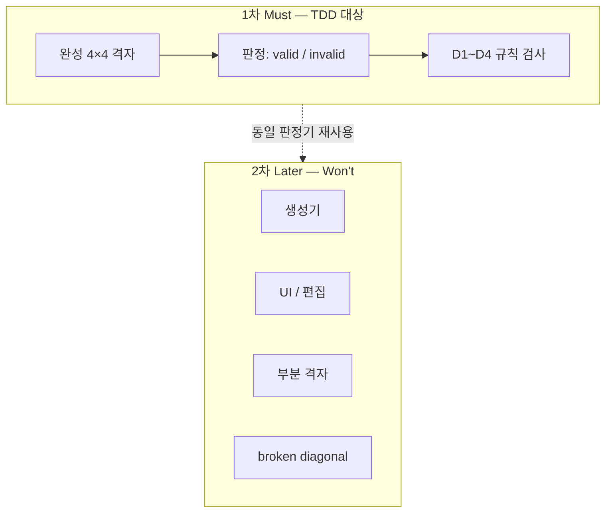
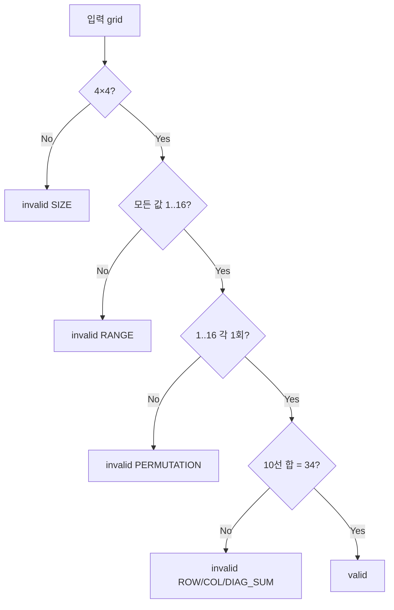

# 4×4 Magic Square — TDD 설계 보고서

| 항목 | 내용 |
|------|------|
| 프로젝트 | MagicSquare_XX |
| 문서 유형 | TDD 설계 (테스트 전략·오라클·계약·Red 순서) |
| 대상 독자 | QA, TDD 개발자 |
| 작성 기준일 | 2026-05-28 |
| 범위 | 1차 검증기(판정) · 완성 격자 · STEP 1~8 |
| **제외** | 구현 코드, 테스트 코드, 알고리즘, 언어·프레임워크 선정 |

---

## 1. 문서 목적

본 보고서는 문제 정의(Report 01)에서 확정한 **규칙 판정**을 대상으로, **구현 전**에 TDD로 고정할 항목을 정리한다.

- **Must / Should / Won’t** 로 1차 범위 고정  
- **검사 선·입출력 계약** 명문화 (Q3)  
- **유·무효 대표 예시** 오라클 (P1, 다중 정답)  
- **Invariant → 테스트 테마** 매핑  
- **TDD Wave** (Red 순서, 시나리오만)  
- **회귀·요구 변경** 시나리오 (Q1, Q2)  

---

## 2. 문제 정의 요약 (전제, 재논의 금지)

### 2.1 진짜 문제

> **4×4 격자에 1부터 16까지 각 숫자가 정확히 한 번씩 배치된 경우, 합의된 선(행·열·정의된 대각선)마다 합이 34인지를 결정론적으로 판정하고, 그 판정 기준을 반복 실행·자동 검증·회귀에 사용할 수 있게 고정하는 것.**

| 구분 | 표면 | 진짜 |
|------|------|------|
| 대상 | 마방진 한 장 | 4×4 배치에 대한 **규칙 판정** |
| 성공 | 숫자 채움 | 유·무효에 **일관된 판정** |
| 산출물 | 프로그램 | **고정된 판정 기준 + 검증 가능한 요구** |

### 2.2 Invariant (상위 기준)

| ID | 불변식 |
|----|--------|
| D1 | 항상 4×4 격자 |
| D2 | 값은 1..16 순열 (각 1회) |
| D3 | 검사 대상 각 선의 합 = 34 |
| D4 | 검사 선 집합은 요구에 명시·고정 |
| P1 | 「만족」= D1~D4 모두 충족 |
| P2 | 동일 입력 → 동일 판정·실패 분류 |
| P3 | 순열·범위 위반은 합이 맞아도 불만족 |
| P4 | (목표) 위반 유형 구분 가능 |
| Q1 | 판정 기준 변경 시 검증 기대 선행 갱신 |
| Q2 | 회귀 후 유·무효 예시 의도 추적 가능 |
| Q3 | 입·출력 계약이 문서와 검증에서 일치 |

**의존:** D2 위반 시 D3만으로 유효 판정하지 않음.

### 2.3 TDD 설계가 막아야 할 함정

1. 특정 패턴만 정답 → **과검증(false negative)**  
2. 생성 결과를 자기 증거로 사용 → **순환 오라클**  
3. 합=34만 검사 → 중복·누락 **미검출**  
4. 데모·한 패턴 구현 = 성공으로 오인  
5. 행만 검사하는 **부분 구현**이 통과처럼 보임  

---

## 3. Must / Should / Won’t

| 구분 | 항목 |
|------|------|
| **Must** | 4×4 **완성** 격자(16칸 모두 1~16)에 대한 **valid / invalid** 판정 |
| **Must** | D1~D4 전부 검사(순열 → 행·열 합 → 주·부대각선) |
| **Must** | 동일 격자 → 동일 판정 (P2) |
| **Must** | 합의된 유·무효 예시 표(본 문서 §6)와 판정 일치 |
| **Should** | 실패 **유형** 분류 (P4): `PERMUTATION`, `RANGE`, `ROW_SUM`, `COL_SUM`, `DIAG_SUM`, `SIZE` |
| **Should** | 검사 순서: **순열(D2) 선행**, 이후 선 합(D3) — QA 우선순위 반영 |
| **Won’t (1차)** | 마방진 **생성**, UI, 편집, 힌트, 점수, 게임 |
| **Won’t (1차)** | **부분 격자**(빈 칸·0·null 셀) |
| **Won’t (1차)** | **broken diagonal** (끊긴 대각선) |
| **Won’t (1차)** | n×n 일반화, 특정 대칭 패턴만 인정 |
| **Later** | 생성·편집 산출물에 **동일 판정기** 적용 |

### 3.1 성공 정의 (관찰 가능)

1. §6의 **유효** 예시(V-01, V-02)는 모두 `valid`.  
2. §6의 **무효** 예시(I-01~I-10)는 모두 `invalid`.  
3. 동일 4×4 입력을 두 번 판정해도 결과·유형이 같다 (P2).  
4. 중복·누락 격자는 행 합이 우연히 34여도 `invalid` (P3).  
5. 데모용 격자 한 장 표시 ≠ 위 1~4 충족 (범위 통제).

### 3.2 범위 다이어그램



**STEP 1 요약:** 1차 TDD는 **완성 격자 검증기 only**. 생성·UI·부분 입력·broken diagonal은 제외. Should로 실패 유형·검사 순서(순열 우선)를 명시한다.

---

## 4. 검사 선·마법 상수 계약 (D3, D4)

### 4.1 좌표 규약

- 격자: `grid[row][col]`, `row`, `col` ∈ {0, 1, 2, 3}  
- 셀 값: 정수, 완성 격자에서는 1..16  

### 4.2 검사 선 집합 (1차 고정)

| ID | 선 종류 | 정의 (포함 셀) |
|----|---------|----------------|
| L01–L04 | 행 0~3 | `(r,0)..(r,3)` 각 r |
| L05–L08 | 열 0~3 | `(0,c)..(3,c)` 각 c |
| L09 | 주대각선 | `(0,0), (1,1), (2,2), (3,3)` |
| L10 | 부대각선 | `(0,3), (1,2), (2,1), (3,0)` |

**총 10선.** 각 선의 합 = **34** (마법 상수 M).

### 4.3 마법 상수 34

4×4, 1~16 사용 시:  
\( M = \frac{4(4^2+1)}{2} = \frac{4 \times 17}{2} = 34 \).

### 4.4 broken diagonal

| 결정 | 1차 **Won't** |
|------|----------------|
| 근거 | 문제 정의에서 명시적 결정 필요로만 언급; 표준 행·열·두 대각선으로 오라클 고정 후 확장(Q1) |

### 4.5 P3 판정 원칙

- D2(순열·범위) 검사 **실패 시** D3(선 합)을 계산하지 않아도 `invalid`.  
- Should 구현 시 실패 유형은 **순열/범위 우선** 보고 (`PERMUTATION` 또는 `RANGE`).  
- 합만 맞고 순열이 깨진 격자는 **절대 valid 아님**.

### 4.6 판정 의사결정



**STEP 2 요약:** 10선(행4·열4·주·부대각). M=34. broken diagonal 제외. 순열 실패 시 valid 금지.

---

## 5. 입출력 계약 (Q3)

### 5.1 입력

| 항목 | 1차 계약 |
|------|----------|
| 형태 | `int[4][4]` 또는 동등한 4행×4열 정수 행렬 |
| 완성도 | **16칸 모두** 유효 정수 (부분 격자 **미지원**) |
| 값域 | 각 셀 ∈ {1,…,16} (완성 격자 전제; 범위 밖이면 `RANGE`) |
| 인덱스 | 0-based row/col |

### 5.2 출력

| 수준 | 계약 |
|------|------|
| **Must** | `valid` \| `invalid` (또는 boolean `isValid`) |
| **Should** | `invalid` 시 `failureType` enum (하나; 복수 위반 시 **우선순위** 적용) |

**실패 유형 우선순위 (Should):**  
`SIZE` → `RANGE` → `PERMUTATION` → `ROW_SUM` → `COL_SUM` → `DIAG_SUM`  
(먼저 걸리는 규칙 하나만 반환; P2 유지)

### 5.3 결정성 (P2)

동일 `grid` → 동일 `valid/invalid` 및 동일 `failureType`.

### 5.4 잘못된 입력 (1차)

| 입력 조건 | 1차 동작 | failureType |
|-----------|----------|-------------|
| 행≠4 또는 열≠4 | `invalid` | `SIZE` |
| null / 빈 참조 | `invalid` | `SIZE` (또는 구현 전 `error` — **Decision Needed**) |
| 셀에 0, 17, 음수 | `invalid` | `RANGE` |
| 중복·누락(1~16 집합 불일치) | `invalid` | `PERMUTATION` |

**Assumption:** 1차는 **예외 throw 없이** `invalid` + 유형으로 통일 (테스트 단순화).

### 5.5 경계 입력 분류

| 클래스 | 예시 | 기대 |
|--------|------|------|
| 구조 오류 | 3×4, 4×5 | invalid, SIZE |
| 값域 오류 | 0, 17, -1 | invalid, RANGE |
| 순열 오류 | 1이 두 번, 16 누락 | invalid, PERMUTATION |
| 선 합 오류 | 순열 OK, 한 행 합≠34 | invalid, ROW_SUM 등 |
| 정상 | §6 V-01, V-02 | valid |

**STEP 3 요약:** 완성 격자만. 출력은 valid/invalid + Should 시 단일 failureType. SIZE/RANGE/PERMUTATION을 선 합보다 우선.

---

## 6. 유·무효 대표 예시 (오라클)

### 6.1 유효 예시 (다중 정답 인정)

**V-01** — 표준 합법 배치

| | c0 | c1 | c2 | c3 |
|---|-----|-----|-----|-----|
| r0 | 1 | 15 | 14 | 4 |
| r1 | 8 | 10 | 11 | 5 |
| r2 | 12 | 6 | 7 | 9 |
| r3 | 13 | 3 | 2 | 16 |

| 항목 | 내용 |
|------|------|
| 기대 | `valid` |
| Invariant | D1–D4, P1 |
| 설계 의도 | 기준 오라클; 행·열·대각 모두 34 |

**V-02** — V-01과 다른 합법 배치

| | c0 | c1 | c2 | c3 |
|---|-----|-----|-----|-----|
| r0 | 16 | 3 | 2 | 13 |
| r1 | 5 | 10 | 11 | 8 |
| r2 | 9 | 6 | 7 | 12 |
| r3 | 4 | 15 | 14 | 1 |

| 항목 | 내용 |
|------|------|
| 기대 | `valid` |
| Invariant | D1–D4, P1 |
| 설계 의도 | **다중 정답** — 특정 패턴이 아닌 규칙 만족만 인정 (과검증 방지) |

### 6.2 무효 예시

**I-01** — 크기 오류 (3×4)

```
1  15  14
8  10  11
12  6   7
13  3   2
```

| 기대 | `invalid`, `SIZE` | Invariant | D1 |

**I-02** — 범위 밖 (17 포함)

| | c0 | c1 | c2 | c3 |
|---|-----|-----|-----|-----|
| r0 | 1 | 15 | 14 | **17** |
| r1 | 8 | 10 | 11 | 5 |
| r2 | 12 | 6 | 7 | 9 |
| r3 | 13 | 3 | 2 | 16 |

| 기대 | `invalid`, `RANGE` | Invariant | D2, P3 |

**I-03** — 0 포함

| r0 | **0** | 15 | 14 | 4 |
| 기대 | `invalid`, `RANGE` |

**I-04** — 중복 (1 두 번)

| r0 | 1 | 15 | 14 | 4 |
| r1 | **1** | 10 | 11 | 5 |
| r2 | 12 | 6 | 7 | 9 |
| r3 | 13 | 3 | 2 | 16 |

| 기대 | `invalid`, `PERMUTATION` | Invariant | D2, P3 |

**I-05** — 누락 (16 없음, 16 두 번 대신 8 중복)

| r3 | 13 | 3 | 2 | **8** | (8이 r1에도 있음) |
| 기대 | `invalid`, `PERMUTATION` |

**I-06** — 행 합 오류 (r0 합≠34)

| r0 | 1 | 15 | 14 | **5** | (합 35) |
| r1–r3 | V-01과 동일 |
| 기대 | `invalid`, `ROW_SUM` | Invariant | D3 |

**I-07** — 열 합 오류 (순열 유지, c0 합≠34)

V-01에서 r0c0↔r0c1 스왑:

| | c0 | c1 | c2 | c3 |
|---|-----|-----|-----|-----|
| r0 | 15 | 1 | 14 | 4 |
| r1 | 8 | 10 | 11 | 5 |
| r2 | 12 | 6 | 7 | 9 |
| r3 | 13 | 3 | 2 | 16 |

| 항목 | 내용 |
|------|------|
| 기대 | `invalid`, `COL_SUM` |
| Invariant | D3 |
| 설계 의도 | 행0 합은 34 유지, **열0 합 48** |

**I-08** — 주대각선 합 오류 (순열 유지)

V-01에서 r0c0↔r1c2 스왑:

| | c0 | c1 | c2 | c3 |
|---|-----|-----|-----|-----|
| r0 | 11 | 15 | 14 | 4 |
| r1 | 8 | 10 | 1 | 5 |
| r2 | 12 | 6 | 7 | 9 |
| r3 | 13 | 3 | 2 | 16 |

| 항목 | 내용 |
|------|------|
| 기대 | `invalid`, `DIAG_SUM` |
| Invariant | D3, D4 |
| 설계 의도 | 주대각 합 **44** (11+10+7+16) |

**I-09** — 부대각선 합 오류 (순열 유지)

V-01에서 r0c0↔r3c3 스왑:

| | c0 | c1 | c2 | c3 |
|---|-----|-----|-----|-----|
| r0 | 16 | 15 | 14 | 4 |
| r1 | 8 | 10 | 11 | 5 |
| r2 | 12 | 6 | 7 | 9 |
| r3 | 13 | 3 | 2 | 1 |

| 항목 | 내용 |
|------|------|
| 기대 | `invalid`, `DIAG_SUM` |
| Invariant | D3, D4 |
| 설계 의도 | 부대각 합 **35** (4+11+7+13) |

**I-10** — 합은 맞지만 순열 깨짐 (P3)

| r0 | 1 | 1 | 14 | 4 |
| r1 | 8 | 10 | 11 | 5 |
| r2 | 12 | 6 | 7 | 9 |
| r3 | 13 | 3 | 2 | 16 |

| 기대 | `invalid`, `PERMUTATION` (행 합 일부 우연 일치 가능) | P3 |

### 6.3 마스터 표 (요약)

| ID | 기대 | failureType (Should) | Invariant | 설계 의도 |
|----|------|----------------------|-----------|-----------|
| V-01 | valid | — | D1–D4 | 기준 valid |
| V-02 | valid | — | D1–D4 | 다중 정답 |
| I-01 | invalid | SIZE | D1 | 크기 |
| I-02 | invalid | RANGE | D2,P3 | 상한 초과 |
| I-03 | invalid | RANGE | D2,P3 | 0 |
| I-04 | invalid | PERMUTATION | D2,P3 | 중복 |
| I-05 | invalid | PERMUTATION | D2,P3 | 누락/중복 |
| I-06 | invalid | ROW_SUM | D3 | 행 합 |
| I-07 | invalid | COL_SUM | D3 | 열0 합 |
| I-08 | invalid | DIAG_SUM | D3,D4 | 주대각 |
| I-09 | invalid | DIAG_SUM | D3,D4 | 부대각 |
| I-10 | invalid | PERMUTATION | P3 | 합만 보면 착각 |

**STEP 4 요약:** 유효 2건(다중 정답). 무효 10건. P3·SIZE·RANGE·PERMUTATION·행·열·대각 분리.

---

## 7. 테스트 전략·Invariant 매핑

### 7.1 계층 (1차)

| 계층 | 책임 | 1차 |
|------|------|-----|
| L1 | 순열·범위·선 합 **순수 규칙** | Must |
| L2 | **판정기** (grid → valid/invalid + 유형) | Must |
| L3 | 입출력 **어댑터** (파싱 등) | Later |

### 7.2 테스트 유형

| 유형 | 1차 | 비고 |
|------|-----|------|
| Table-driven (예시 ID 기반) | **Must** | §6 오라클 직접 매핑 |
| 경계값 | Must | SIZE, RANGE, 1, 16 |
| 속성 기반 (random 순열) | Won't | 1차 오라클 고정 우선 |

### 7.3 네이밍 규칙

`should_<기대>_when_<조건>`

예: `should_be_valid_when_grid_V01`, `should_be_invalid_permutation_when_duplicate_1`

### 7.4 Invariant → 테스트 테마

| ID | 테스트 테마 |
|----|-------------|
| D1 | `size_4x4_required` |
| D2 | `values_are_permutation_1_to_16` |
| D3 | `each_line_sum_equals_34` |
| D4 | `lines_are_rows_cols_main_anti_diagonal` |
| P1 | `valid_only_if_all_domain_rules_pass` |
| P2 | `same_grid_same_result` |
| P3 | `permutation_failure_before_line_sums` |
| P4 | `failure_type_matches_violation` |
| Q1 | `requirement_change_updates_oracle_first` |
| Q2 | `regression_suite_tracks_V_I_ids` |
| Q3 | `io_contract_matches_document` |

**STEP 5 요약:** L1+L2, table-driven, 예시 ID 네이밍, Invariant별 테마 1개 이상.

---

## 8. TDD Wave (Red 순서)

### Wave 0 — D1 구조

| 항목 | 내용 |
|------|------|
| Invariant | D1 |
| 예시 ID | I-01 |
| Given | 3×4 정수 배열 |
| When | 판정기 호출 |
| Then | invalid, SIZE |
| Red 사유 | 크기 검사 미구현 |

추가: 4×4 null → invalid SIZE.

### Wave 1 — D2, P3 순열·범위

| 예시 | Then |
|------|------|
| I-02, I-03 | invalid, RANGE |
| I-04, I-05, I-10 | invalid, PERMUTATION |
| V-01 | 아직 valid 아님 (선 합 미구현) — **의도적 Red** |

**Red 사유:** 순열 검사만 추가; 선 합 없음.

### Wave 2 — D3 행·열

| 예시 | Then |
|------|------|
| I-06 | invalid, ROW_SUM |
| I-07 | invalid, COL_SUM |
| V-01 | valid (대각 미검 시 Wave 3까지 Red 가능) |

**Red 사유:** 행·열만 검사; 대각 제외 시 V-01 false negative.

### Wave 3 — D3, D4 대각선

| 예시 | Then |
|------|------|
| I-08, I-09 | invalid, DIAG_SUM |
| V-01, V-02 | valid |

**Red 사유:** 10선 전체 검사 완료 전 V-02 실패.

### Wave 4 (Should) — P4 유형 분리

| Given | Then |
|-------|------|
| I-04 vs I-06 | PERMUTATION vs ROW_SUM 구분 |
| 우선순위 | SIZE > RANGE > PERMUTATION > … |

### Wave 5 — Q1, Q2 회귀

| Given | Then |
|-------|------|
| broken diagonal 요구 추가 가정 | I-01~V-02 회귀 green 유지 |
| V-01, I-04, I-06, V-02, I-01 | **핵심 회귀 5건** 항상 실행 |

### Red 순서 번호

1. size_4x4 → 2. range → 3. permutation → 4. row_col_sums → 5. diagonal_sums → 6. failure_type → 7. regression_pack

**STEP 6 요약:** Wave 0~5, 순열 선행, V-01은 Wave 3에서 비로소 valid. 핵심 회귀 5 ID.

---

## 9. 회귀·요구 변경 (Q1, Q2)

### 9.1 시나리오 RC-1: broken diagonal 추가

| | 내용 |
|---|------|
| 변경 | D4에 broken diagonal 4선 추가 |
| 영향 예시 | V-01, V-02 재검증; 새 무효 예시 추가 |
| Before | V-01 valid |
| After | 동일 (표준 10선만이면) — broken 위반 격자는 신규 invalid |
| 선행 갱신 | 오라클 표 → `should_*_broken_diag_*` 테스트 이름 |

### 9.2 시나리오 RC-2: 실패 유형 세분화 (P4)

| | 내용 |
|---|------|
| 변경 | `ROW_SUM` vs `COL_SUM` vs `DIAG_SUM` 분리 |
| 영향 | I-06, I-07, I-08 각각 고유 유형 |
| Before | 모두 `invalid` only |
| After | 유형별 assert |
| 선행 | `failure_type_matches_violation` 테마 |

### 9.3 핵심 회귀 스위트 (5건)

| ID | 이유 |
|----|------|
| V-01 | valid 기준 |
| V-02 | 다중 정답 |
| I-04 | PERMUTATION / P3 |
| I-06 | 선 합 |
| I-01 | SIZE / D1 |

**STEP 7 요약:** RC-1 broken diagonal, RC-2 유형 세분화. 회귀 5건 고정.

---

## 10. 가정·미결정·리스크

### 10.1 Assumption

| # | 가정 |
|---|------|
| A1 | 1차 입력은 항상 4×4 배열 (파싱 없음) |
| A2 | invalid 시 예외 없이 결과 객체 반환 |
| A3 | 주·부대각선만 “대각선” (D4) |
| A4 | I-07~I-09 격자는 V-01 스왑으로 합산 검증 완료 |
| A5 | 복수 위반 시 우선순위 enum 하나만 반환 |
| A6 | 1차 TDD는 검증기 only |
| A7 | 유효 = 수학적 규칙 만족, 특정 패턴 아님 |

### 10.2 Decision Needed

| # | 질문 |
|---|------|
| D-N1 | null 입력: `SIZE` vs 별도 `error`? |
| D-N2 | DIAG_SUM 시 주대각·부대각 구분 메시지 필요 여부 |
| D-N3 | Should failureType 1차 Must로 승격할지 |

### 10.3 리스크

| 리스크 | 완화 |
|--------|------|
| 과검증 (한 패턴만 valid) | V-02 다중 정답 필수 |
| 미검증 (행만 검사) | Wave 3까지 V-01 Red 유지 |
| 순환 오라클 | 생성기 TDD 제외 |
| 스코프 크립 | Must/Won’t 표 준수 |
| 잘못된 fixture | Red 전 수동 합 검산 |

**STEP 8 요약:** 가정 7, 미결정 3, 리스크 5.

---

## 11. 전체 흐름


---

## 12. 변경 이력

| 버전 | 일자 | 내용 |
|------|------|------|
| 1.0 | 2026-05-28 | TDD 설계 초판 (STEP 1~8, 오라클·Wave·회귀) |

---

*본 문서는 구현 설계, 코드, 알고리즘을 포함하지 않는다.*
