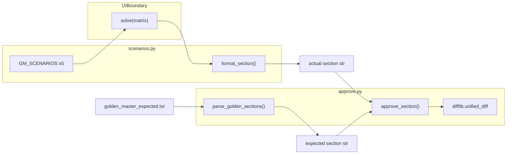

# 4×4 Magic Square — Golden Master GM-2 완료 보고서

| 항목 | 내용 |
|------|------|
| 프로젝트 | MagicSquare_XX |
| 문서 유형 | Golden Master 회귀 안전장치 (GM-2) 완료 |
| TDD phase | **GREEN** 이후 REFACTOR 전 회귀 게이트 |
| 작성 기준일 | 2026-05-29 |
| 범위 | GM-01~GM-10 (기준 파일 · approve 패턴 · 5 TC · README) |
| SSOT | `docs/golden_master_approve_pattern.md`, `tests/golden_master/scenarios.py` |

---

## 1. 목적

Magic Square Solver(`UIBoundary.solve()`)의 **실제 출력**을 Golden Master 기준으로 고정하고, REFACTOR 및 후속 Wave 진행 시 **actual vs expected** 비교로 회귀를 탐지한다.

| 목표 | 결과 |
|------|------|
| GM-01 `golden_master_expected.txt` 생성 | ✅ |
| GM-02 정상/역순/오류 5 시나리오 | ✅ |
| GM-03 기준 파일 버전 관리 준비 | ✅ (`tests/golden_master_expected.txt`) |
| GM-04 `test_golden_master_magic_square` | ✅ |
| GM-05 approve 패턴 | ✅ |
| GM-06 Golden Master 5 TC PASS | ✅ |
| GM-07 row-major 규칙 보호 | ✅ (GM-TC-01) |
| GM-08 1-index 출력 보호 | ✅ (GM-TC-01, GM-TC-02) |
| GM-09 reverse fallback 보호 | ✅ (GM-TC-02) |
| GM-10 Error Contract 보호 | ✅ (GM-TC-03~05) |

---

## 2. 아키텍처



**출력 캡처:** stdout 대신 **Result DTO** (`SuccessResponse` / `FailureResponse`) 직렬화 — UI/CLI 변경에 덜 민감.

---

## 3. 시나리오 (GM-TC-01 ~ GM-TC-05)

| Test ID | Section ID | 입력 요약 | 기대 출력 |
|---------|------------|-----------|-----------|
| GM-TC-01 | `normal_success` | PRD/RD 4×4, 빈칸 2 | `[3,3,6,4,4,1]` |
| GM-TC-02 | `reverse_success` | G1 격자, small-first 실패 | `[2,2,10,3,3,7]` |
| GM-TC-03 | `invalid_blank_count` | 빈칸 3개 | `E002_INVALID_BLANK_COUNT` |
| GM-TC-04 | `duplicate_number` | non-zero 중복 | `E005_DUPLICATE_NONZERO` |
| GM-TC-05 | `no_valid_solution` | 두 조합 모두 실패 | `E005_UNSOLVABLE_TWO_COMBINATIONS` |

시나리오 SSOT: `tests/golden_master/scenarios.py` (`GM_SCENARIOS`).

---

## 4. 구현 산출물

### 4.1 기준 파일

| 경로 | 역할 |
|------|------|
| `tests/golden_master_expected.txt` | 버전 관리되는 Golden Master baseline |
| `scripts/generate_golden_master.py` | baseline 재생성 CLI |

### 4.2 테스트·헬퍼

| 경로 | 역할 |
|------|------|
| `tests/golden_master/scenarios.py` | 입력 격자, DTO 캡처, `format_section`, `run_scenario` |
| `tests/golden_master/approve.py` | `approve`, `approve_section`, `parse_golden_sections` |
| `tests/unit/test_golden_master_magic_square.py` | `@pytest.mark.golden_master`, parametrized 5 TC |

### 4.3 Approve 패턴

| 상태 | 동작 |
|------|------|
| 기준 파일 **없음** | `build_golden_master_document()`로 bootstrap 생성 후 PASS |
| 기준 파일 **있음** | 섹션 단위 문자열 동일성 비교 |
| **불일치** | `--- expected` / `+++ actual` unified diff 후 `AssertionError` |

**설계 결정:**

- 섹션 헤더 정규식: `^\[(?P<section_id>[a-z][a-z0-9_]*)\]$` — payload `[3,3,6,4,4,1]` 오인 방지
- 섹션 비교 전 trailing newline 정규화 (`_normalize_section`)

### 4.4 pytest 마커

`pyproject.toml`:

```toml
markers = [
    "golden_master: GM-2 Golden Master regression (approve pattern)",
]
```

---

## 5. pytest 실행 결과

```powershell
python -m pytest tests/unit/test_golden_master_magic_square.py -m golden_master -v
```

**결과:** ✅ **5 passed**

```text
test_gm2_scenario[GM-TC-01] PASSED
test_gm2_scenario[GM-TC-02] PASSED
test_gm2_scenario[GM-TC-03] PASSED
test_gm2_scenario[GM-TC-04] PASSED
test_gm2_scenario[GM-TC-05] PASSED
```

> **주의:** `pytest -m golden_master`만 실행하면 Dual-Track RED 스켈레ton(`tests/boundary/`) import 오류로 collection이 실패할 수 있음. GM 전용 실행 시 **파일 경로 지정** 권장.

---

## 6. README 갱신 (GM-3)

`README.md` → `## RED 단계 To-Do 리스트` 하위에 **Golden Master 회귀 안전장치** 섹션 추가 (GM-01~GM-10 체크리스트).

---

## 7. 기준 파일 갱신 절차

```powershell
# 의도적 스펙 변경 시
python scripts/generate_golden_master.py
git add tests/golden_master_expected.txt

# 또는 APPROVE 모드
$env:APPROVE = "1"
python -m pytest tests/unit/test_golden_master_magic_square.py -m golden_master -v
python scripts/generate_golden_master.py
```

---

## 8. 범위 제외

- ECB 30건 회귀 변경 없음
- Dual-Track GREEN (`src/boundary/` solver 외 FR-02~05) — GM은 Dual-Track `UIBoundary` 기준
- REFACTOR 본문 (GM은 REFACTOR **전** 안전장치)

---

## 9. 다음 단계

- REFACTOR Wave — GM-2 회귀 유지 (`pytest … -m golden_master`)
- Dual-Track D1~D6 GREEN — GM baseline 갱신 필요 시 `generate_golden_master.py`
- `git add tests/golden_master_expected.txt` — GM-03 커밋 포함

---

## 10. 관련 문서

| 유형 | 경로 |
|------|------|
| Approve 패턴 | `docs/golden_master_approve_pattern.md` |
| Transcript | `Prompting/12. cursor_magicsquare_golden-master-gm2-gm3-Prompt.md` |
| README GM 섹션 | `README.md` § RED → Golden Master 회귀 안전장치 |
