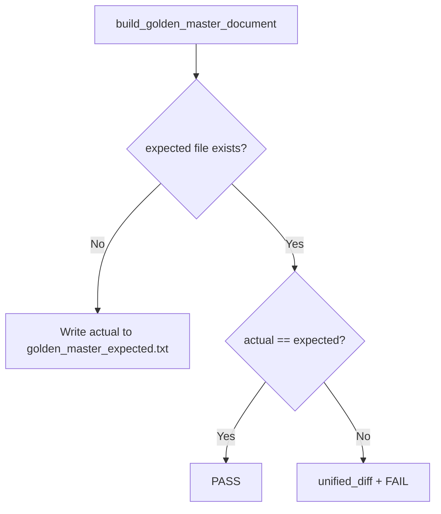

# Golden Master Approve Pattern (GM-2)

| 항목 | 내용 |
|------|------|
| 문서 ID | GM-2-APPROVE |
| 대상 | `UIBoundary.solve()` — Result DTO 직렬화 |
| 기준 파일 | `tests/golden_master_expected.txt` |
| 생성 스크립트 | `scripts/generate_golden_master.py` |
| 회귀 테스트 | `tests/unit/test_golden_master_magic_square.py` |

---

## 1. 목적

Magic Square Solver의 **실제 출력**을 고정 기준(Golden Master)으로 저장하고, 이후 코드 변경 시 **actual vs expected** 비교로 회귀를 탐지한다.

출력 캡처 방식: **Result DTO** (`SuccessResponse` / `FailureResponse`)를 사람이 읽을 수 있는 블록 형식으로 직렬화한다. (stdout 캡처 대신 DTO 기준 — UI/CLI 변경에 덜 민감함.)

---

## 2. 시나리오 (GM-2)

| Test ID | Section ID | 설명 |
|---------|------------|------|
| GM-TC-01 | `normal_success` | 유효 부분 격자, 성공 payload |
| GM-TC-02 | `reverse_success` | G1: small-first 실패 → reverse 성공 |
| GM-TC-03 | `invalid_blank_count` | 빈칸 3개 |
| GM-TC-04 | `duplicate_number` | non-zero 중복 |
| GM-TC-05 | `no_valid_solution` | 검증 통과, 두 조합 모두 실패 |

시나리오 정의: `tests/golden_master/scenarios.py` (`GM_SCENARIOS`).

---

## 3. 기준 파일 구조

```text
[normal_success]
Input:
16 2 3 13
5 11 10 8
9 7 0 12
4 14 15 0
Output:
[3,3,6,4,4,1]

[reverse_success]
Input:
...
Output:
[2,2,10,3,3,7]

[invalid_blank_count]
Input:
...
Error:
E002_INVALID_BLANK_COUNT

...
```

- **성공**: `Output:` + `[r1,c1,n1,r2,c2,n2]` (쉼표 구분, 공백 없음)
- **실패**: `Error:` + Boundary `FailureResponse.code` (예: `E002_INVALID_BLANK_COUNT`)
- 섹션 구분: `[section_id]` 헤더, 섹션 사이 빈 줄 1개

---

## 4. Approve 패턴



| 상태 | 동작 |
|------|------|
| 기준 파일 **없음** | 현재 `actual`을 기준 파일로 **자동 생성** 후 PASS |
| 기준 파일 **있음** | 문자열 동일성 비교 |
| **불일치** | `difflib.unified_diff` 출력 후 `AssertionError` |

구현: `tests/golden_master/approve.py` — `approve_section(actual, section_id, expected_path)`.

---

## 5. 기준 파일 생성 / 갱신

### 5.1 생성 스크립트 (권장)

```powershell
python scripts/generate_golden_master.py
git add tests/golden_master_expected.txt
```

### 5.2 pytest 부트스트랩

기준 파일이 없는 클론에서 첫 실행 시 `test_gm2_scenario`가 `approve_section()`으로 전체 기준 파일을 생성한다.

### 5.3 의도적 갱신 (APPROVE)

출력 변경이 **정당한 스펙 변경**일 때:

```powershell
$env:APPROVE = "1"
python -m pytest -m golden_master -v
# tmp 기준으로 통과 확인 후, 스크립트로 repo 기준 파일 재생성
python scripts/generate_golden_master.py
git add tests/golden_master_expected.txt
```

메시지에 `Re-run with APPROVE=1` 안내가 포함된다.

---

## 6. 회귀 실행

```powershell
python -m pytest -m golden_master -v
```

ECB/Dual-Track 전체와 분리된 GM-2 전용 테스트이다.

---

## 7. 설계 결정

| 결정 | 이유 |
|------|------|
| DTO 직렬화 | FR-05/Boundary 계약(`code`, `payload`)을 직접 고정 |
| 전체 파일 단일 비교 | 섹션 단위 diff가 unified diff에 그대로 반영됨 |
| 시나리오 코드 공유 | 생성 스크립트·테스트·문서가 동일 오라클 사용 |
| `E00x_*` 코드 그대로 기록 | 스키마 `FailureResponse.code`와 1:1 대응 |

---

## 8. 관련 파일

| 경로 | 역할 |
|------|------|
| `tests/golden_master_expected.txt` | 버전 관리되는 기준 출력 |
| `tests/golden_master/scenarios.py` | 입력 격자 + DTO 캡처/포맷 |
| `tests/golden_master/approve.py` | approve 비교 |
| `scripts/generate_golden_master.py` | 기준 파일 재생성 CLI |
| `tests/unit/test_golden_master_magic_square.py` | GM-2 회귀 테스트 (5 TC, `@pytest.mark.golden_master`) |
